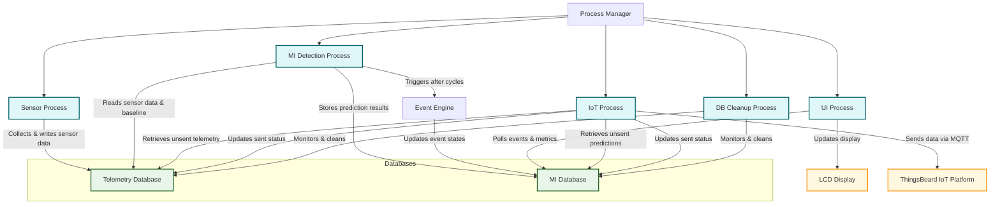

# Cyclops

Cyclops is an edge computing system tailored for scent monitoring and chemical analysis. Running on a Raspberry Pi 4B, it collects data from a proprietary sensor array (BFU), processes it using machine learning models, detects environmental events, and communicates with cloud services using IoT protocols. Unlike traditional cloud-based systems, Cyclops is designed to operate offline, offering robust computational capabilities at the edge.

---

## System Architecture

Cyclops is built with a modular, multi-process architecture ensuring reliability through independent process management, automatic recovery, and efficient resource allocation. The central **Process Manager** orchestrates five parallel processes, all sharing data through two SQLite databases.

### Architecture Diagram

Below is a simplified [Mermaid](https://mermaid.js.org/) diagram that visually represents the system architecture:



### Process Details

1. **Sensor Process**:  
   - Continuously collects sensor data using the BFU sensor interface.  
   - Writes data to the **Telemetry Database** while managing concurrent access with semaphores.

2. **MI Detection Process**:  
   - Retrieves recent sensor data and baseline from the **Telemetry Database**.  
   - Normalizes data and performs inference using pre-trained ML models.  
   - Stores prediction results in the **MI Database** and triggers the **Event Engine** after a set number of cycles.

3. **IoT Process**:  
   - Retrieves unsent data from both databases.  
   - Formats and sends data to the **ThingsBoard IoT Platform** (via MQTT).  
   - Updates the sent status in each database upon successful transmission.

4. **UI Process**:  
   - Continuously polls the **MI Database** for the latest event details.  
   - Updates the LCD display with system status, event states, and environmental readings.

5. **DB Cleanup Process**:  
   - Monitors the size of both databases.  
   - Executes cleanup operations to prevent storage overflow and maintain system performance.

---

## Data Flow Overview

1. **Sensor Data Collection**  
   - The sensor interface reads raw data from the BFU unit via serial communication.  
   - Data is stored in the Telemetry Database using controlled access to ensure data integrity.

2. **Machine Intelligence Processing**  
   - The MI Detection process retrieves sensor data, applies normalization, and runs ML inference.  
   - Prediction results are saved in the MI Database, and events are triggered based on configured cycles.

3. **Event Detection**  
   - The Event Engine analyzes the latest predictions from the MI Database.  
   - It determines if environmental events are occurring and updates event states accordingly.

4. **User Interface Update**  
   - The UI process polls the MI Database and updates the LCD display with real-time event and system information.

5. **IoT Communication**  
   - The IoT (MQTT) process gathers unsent data from both databases, formats payloads, and communicates with the cloud.  
   - Successful transmission triggers an update to the databases.

6. **Database Maintenance**  
   - The DB Cleanup process continuously monitors the database sizes and performs cleanup operations to ensure ongoing system stability.

---

## Core Modules

### Event Module

- **EventEngine**: Monitors sensor data and triggers events based on thresholds.
- **EventObserver**: Implements the Observer pattern for efficient notifications.
- **EventData & EventConfig**: Define event data structures and manage detection configurations.

### Database Architecture

- Utilizes SQLAlchemy with SQLite.
- Implements the Singleton pattern for efficient database connections.
- Features Write-Ahead Logging (WAL), connection pooling, and automatic cleanup to ensure optimal performance.

### Machine Learning Pipeline

- **Data Preprocessing**: Normalizes raw sensor data using baseline calibration.
- **Model Inference**: Uses a TensorFlow Lite model for analyte prediction, supporting multiple compounds with specific filtering parameters.

### IoT Communication Module

- Uses ThingsBoard's MQTT client with asynchronous operations and QoS support.
- Automatically handles reconnections and validates payloads for robust cloud communication.

### User Interface Module

- Provides real-time feedback through an RGB1602 LCD display.
- Displays system status, events, environmental readings, and system metrics.

### Process Management

- The central Process Manager starts, monitors, and gracefully shuts down all processes.
- Uses semaphores to manage resource contention and ensures resilience with automatic restarts on failure.

---

## Installation and Setup

### Hardware Requirements

- Raspberry Pi 4B (or compatible SBC)
- BFU sensor array
- RGB1602 LCD display
- Internet connectivity for cloud communication

### Software Requirements

- Python 3.x
- SQLite3, I2C support
- Google Cloud SDK (optional for cloud storage)

### Setup Process

1. **Install pip and system updates**
   ```bash
   sudo apt update && sudo apt upgrade -y
   sudo apt install python3-pip
   pip --version
   ```

2. **Set up Virtual Environment**
   ```bash
   python -m venv /path/to/virtual/environment
   source /path/to/virtual/environment/bin/activate
   ```

3. **Install Dependencies**
   ```bash
   pip install [path to wheel in whls folder]
   pip install -r requirements.txt
   ```

4. **Database Setup**
   ```bash
   sudo apt-get install sqlite3
   ```

5. **I2C Configuration (for LCD Display)**
   ```bash
   i2cdetect -y 1
   sudo raspi-config
   ```

---

## Code Structure

```
.
├── src                      # Main application code
│   ├── main.py              # Process Manager / Driver code
│   ├── seed.py              # Database seeding utility
│   ├── config.json          # System configuration file
│   ├── constants.py         # System-wide constants
│   ├── .env                 # Environment variables
│   ├── miModule/            # Machine Intelligence Module
│   ├── sensorModule/        # Sensor interface and processing
│   ├── telemetryDatabase/   # Telemetry database management
│   ├── miDatabase/          # MI database management
│   ├── iotGateway/          # IoT communication (MQTT)
│   ├── lcdModule/           # User interface components
│   ├── eventModule/         # Event detection and handling
│   └── utils/               # Utility functions and helpers
├── whls                     # Pip wheels for required dependencies
├── requirements.txt         # Python package dependencies
└── README.md
```

---

## Deployment

Cyclops is designed to launch automatically at system boot using cron jobs:

1. **Cleanup Script** (executed at boot)
   ```
   @reboot sleep 10 && /home/pi/edge-pi-poc/cleanUp.sh
   ```

2. **Main Application**
   ```
   @reboot sleep 30 && /home/pi/edge-pi-poc/run.sh >> /home/pi/edge-pi-poc/out.txt 2>&1
   ```

The `run.sh` script:
- Navigates to the project directory.
- Activates the Python virtual environment.
- Launches the main application via `main.py`.

---

## ThingsBoard MQTT Communication

The MQTT module handles cloud communication using ThingsBoard's MQTT client. It uses environment variables for configuration and ensures reliable data transmission with:

- **Asynchronous operations**
- **Automatic reconnection**
- **Quality of Service (QoS) support**
- **Payload validation**

**Configuration Environment Variables:**
- `THINGSBOARD_HOST`
- `THINGSBOARD_PORT`
- `THINGSBOARD_DEVICE_TOKEN`
- `EDGE_DEVICE_TYPE`
- `EDGE_DEVICE_SERIAL_NUMBER`

---

## Performance Optimizations

Cyclops is optimized for:
- **Database Performance**: Uses WAL, connection pooling, and regular cleanup.
- **Memory Management**: Efficient data structures and resource cleanup.
- **Network Efficiency**: Asynchronous operations and efficient payload formatting.

---

## Security Considerations

1. **Authentication**:  
   - Token-based authentication with secure credential storage.

2. **Data Security**:  
   - Encrypted MQTT communication and secure cloud storage access.

3. **Network Security**:  
   - Firewall configurations, use of secure protocols, and regular updates.

---

## Troubleshooting

### Database Issues
```bash
sqlite3 database.db "PRAGMA integrity_check;"
sqlite3 database.db "VACUUM;"
```

### I2C Issues
```bash
i2cdetect -y 1
sudo raspi-config
```

### Python Dependencies
```bash
sudo apt install python3-dev python3-pip
```

### Network Issues
```bash
ping thingsboard.server
mosquitto_pub -h thingsboard.server -p 1883 -t test -m "test"
```

---

## Error Handling

Cyclops implements robust error handling using Python's logging framework:
- **Structured Logging**: Severity levels and clear messages.
- **Exception Handling**: Graceful fallbacks and automatic reconnections.
- **Process Resilience**: Automatic restart of failed processes and clear logging for troubleshooting. 
